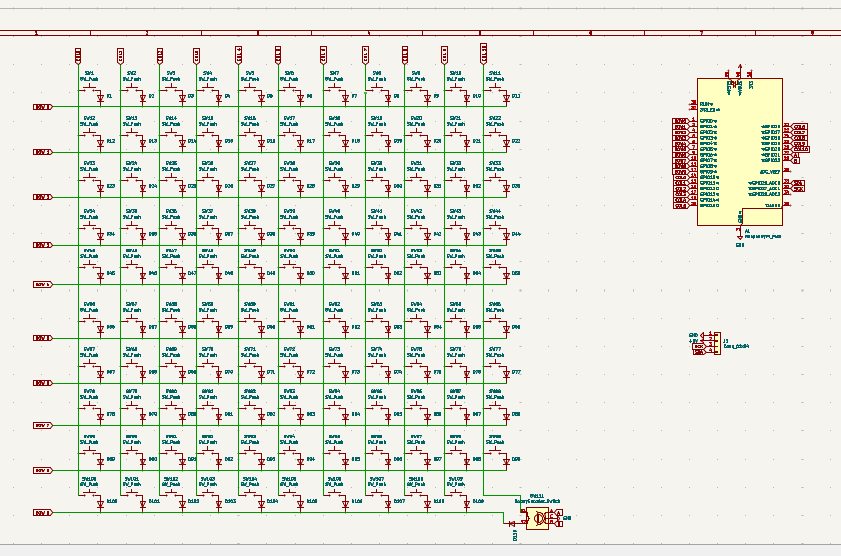
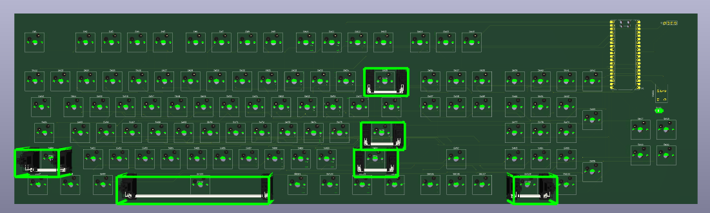
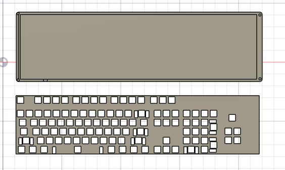
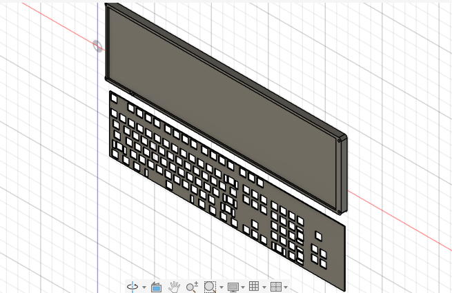
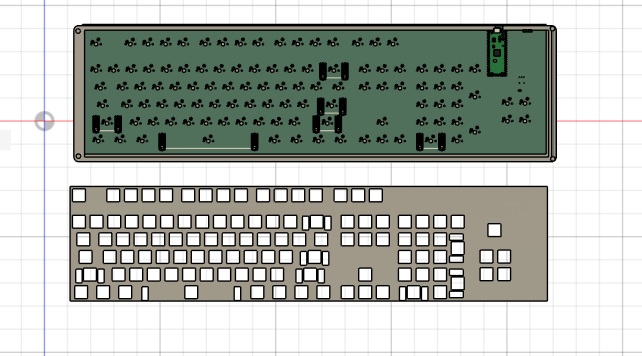

# Full_keyboard
this is a full size keyboard with how swap key,knob and display 
# PCB 

# CAD

# BOM
| No | Product Name | Quantity | Price per Piece (₹) | Total Price (₹) | Total Price (USD) | Note | Link |
| :--- | :--- | :---: | :---: | :---: | :---: | :--- | :---: |
| 1 | SOD-123 Switching Diodes ROHS | 110 | 1.43 | 157.30 | 1.74 | | [View](https://robu.in/product/1n4148w-slkor-75v-1v-4ns-150ma-sod-123-switching-diodes-rohs/) |
| 2 | Raspberry PI PICO H | 1 | 499.00 | 499.00 | 5.54 | | [View](https://robu.in/product/raspberry-pi-pico-with-headers/) |
| 3 | 0.96 inch Yellow-Blue OLED Display Module | 1 | 156.00 | 156.00 | 1.73 | | [View](https://robu.in/product/0-96-inch-yellow-yellow-blue-oled-lcd-led-display-module/) |
| 4 | Hongyan EC11H 5-Pin Vertical Rotary Encoder | 1 | 55.00 | 55.00 | 0.61 | | [View](https://robu.in/product/hongyan-ec11h-7ce20p1zy15f7-rotary-encoder-with-push-button-switch-vertical-plug-in-5-pin/) |
| 5 | Kailh Hot-swap Socket | 11 | 72.00 | 792.00 | 8.79 | | [View](https://meckeys.com/shop/accessories/keyboard-accessories/key-switches/kailh-hot-swap-socket/?attribute_pa_variations=black) |
| 6 | Gateron G Pro 3.0 Switch | 11 | 157.50 | 1,732.50 | 19.22 | | [View](https://meckeys.com/shop/accessories/keyboard-accessories/key-switches/gateron-g-pro-3-0-switch/) |
| 7 | PCB | 1 | 3,179.25 | 3,179.25 | 50.46 | 35.20 + 15.26 (Deliver) | [View](https://jlcpcb.com/) |
| 8 | 3D print | 1 | 1,346.00 | 1,346.00 | 14.93 | | [View](https://robu.in/product/3d-printing-service/) |
| | **Total** | | | **7,917.05** | **103.01** | | |
